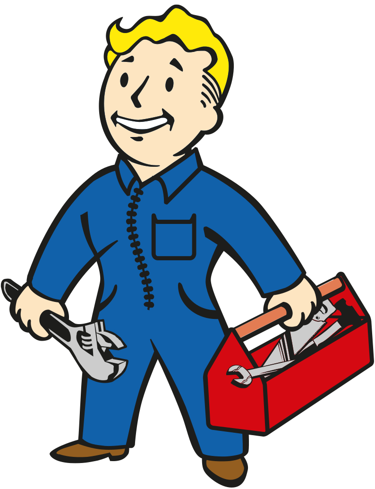
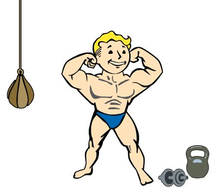

<div align="center">


# Finn Paulsen
### Developer • Tinkerer • Vault Dweller


*Building things that work, one line at a time*

[](https://github.com/Finn-paulsen)
[](https://github.com/Finn-paulsen)

</div>

---



## 🛠️ What I Do

I build **tools, automation scripts, and web applications** with a focus on clean code and great developer experience.

**Currently working on:**
- 🗂️ Retro-futuristic file manager
- ⚡ PowerShell & Bash automation
- 🎮 Terminal UIs with CRT effects

**My approach:**
- Write maintainable, documented code
- Solve real problems with simple solutions
- Keep the retro aesthetic alive

<br clear="right"/>

---


## 💻 Tech Stack

**Languages I use:**  
Python • JavaScript • Node.js • HTML/CSS

**Tools I work with:**  
Git • VS Code • Linux • Windows • PowerShell

**Currently learning:**  
Rust • TypeScript • Modern Web Frameworks

<br clear="left"/>

---


## 📦 Featured Projects

| Project | Description | Status |
|---------|-------------|--------|
| **FileExplorer** | Retro terminal-style file manager | 🔨 In Development |
| **Automation Scripts** | Workflow optimization tools | ✅ Active |
| **Terminal UIs** | CRT effects & nostalgic interfaces | ✅ Complete |
| **Discord Bots** | Automated management systems | ✅ Operational |

> 💡 Check out my pinned repositories for more!

<br clear="right"/>

---

## 📊 GitHub Stats

<div align="center">


<br><br>


</div>

---



## 🎯 Current Goals

**Learning:**
- Master modern web frameworks
- Dive deeper into systems programming
- Contribute to open-source projects

**Building:**
- Production-ready applications
- Tools that make developers' lives easier
- More retro-inspired UIs

<br clear="left"/>

---

<div align="center">


## 📬 Get In Touch

Want to collaborate or just chat about code?  
Feel free to reach out!

[](https://github.com/Finn-paulsen)

<br>

```
"Prepare for the future" — Vault-Tec Industries
```

<sub>⚡ Powered by passion, curiosity & too much coffee</sub>

</div>
