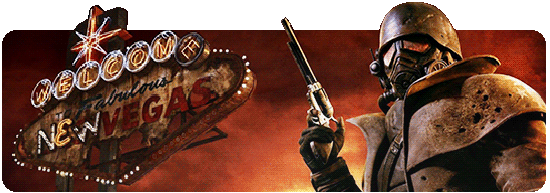

<div align="center">

# Finn Paulsen
### Full-Stack Developer • Bot Creator • Vault Dweller


*Crafting web experiences*



[](https://github.com/Finn-paulsen)
[](https://github.com/Finn-paulsen)

</div>
<br>
<br>


## 🛠️ What I Do

I'm a **full-stack web developer** specializing in building modern websites, Discord bots, and automation tools with a passion for clean code and retro aesthetics.

**Currently building:**
- 🌐 Modern web applications with React & Tailwind
- 🤖 Discord bots with advanced automation
- 🗂️ Retro-futuristic file managers & tools

**My philosophy:**
- Write clean, maintainable, and well-documented code
- Build tools that solve real problems elegantly
- Keep the retro-futuristic aesthetic alive 
<br clear="right"/>
<br>
<br>


## 💻 Tech Stack

**Frontend Development:**  


**Backend & Scripting:**  


**Tools & Platforms:**  
Git • VS Code • Discord.js • Linux • Windows

**Currently exploring:**  
Rust • TypeScript • Next.js • Cloud Deployment
<br clear="left"/>
<br>
<br>


## 📦 Featured Projects

| Project | Tech Stack | Status |
|---------|-----------|--------|
| **Modern Web Apps** | React • Tailwind • Node.js | 🔨 Active |
| **Discord Bots** | Python • Discord.js • C# | ✅ Operational |
| **FileExplorer** | Terminal UI • CRT Effects | 🔨 In Development |
| **Automation Scripts** | PowerShell • Bash • Python | ✅ Active |
| **Retro UIs** | HTML/CSS • Vintage Design | ✅ Complete |

> 💡 Check out my pinned repositories for detailed projects!
<br clear="right"/>
<br>
<br>
<div align="center">


## 📊 GitHub Stats
<br>


</div>
<br>
<br>


## 🎯 What I'm Up To

**Learning & Growing:**
- ⚛️ Deep-diving into React ecosystem & Next.js
- ☁️ Exploring cloud deployment & DevOps
- 🧪 Contributing to open-source projects
<br clear="left"/>
<br>
<br>
<div align="center">

<br>
```
"Prepare for the future" — Vault-Tec Industries
```
</div>
